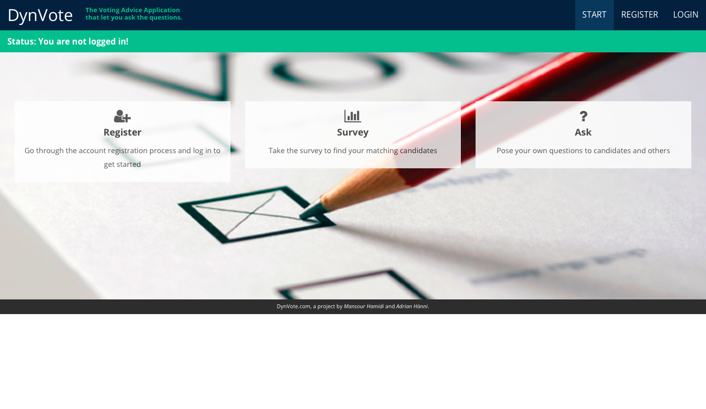

# DynVote
###### The Voting Advice Application With Dynamic User Profiles
###### [https://dynvote.herokuapp.com](https://dynvote.herokuapp.com)
---

The application DynVote is a Voting Advice Application designed in the fashion of SmartVote that provides users with recommendations of candidates based on the degree of accordance of their political profiles. Unlike other VAAs, DynVote matches voters with candidates on a dynamic level, which means that user profiles are not static. A dynamic user profile in this application is characterized by the feature that lets voters and candidates create own questions and publish them to other users.

 

## Installation Guide:
Please follow the following instructions in order to make the application run locally:

* Clone the Project: [GitHub Repository](https://github.com/adrian-haenni/dynvote)
* Install Django: [Django Installation Guide](https://docs.djangoproject.com/en/1.8/topics/install/)
* Install SQLite: [SQLite Installation Guide](http://www.tutorialspoint.com/sqlite/sqlite_installation.htm)
* Go to your Terminal and type:
    * `$ cd dynvote`
    * `$ python manage.py makemigrations`
    * `$ python manage.py migrate`
    * `$ python manage.py runserver`
    * `$ open "http://localhost:8000"`

 

## User Manual:
After having successfully installed the environment, you can start to use the application. 

    

The first step to get login access is to register yourself. Required fields are the username, password, and group. The group selection specifies whether you are Voter or Candidate. 

    

Note that you are not automatically logged in after the registration. You can log in by clicking on the *Login* tab and filling out the requested credentials. 

    

After the successful login, you can click the *Surveys* tab that leads you to the base questionnaire. Before you can answer the questions, you have to select a survey, like for instance, *Elections to the National Council 2015* or *Elections to the Council of States 2015*. Please note that you have the possibility to give no answer. 

    

In addition to the base questionnaire you have the choice of creating a question by yourself. To do that, just click the *Ask* tab, place your question, select category type and survey list, and determine the voters and candidates your question should be forwarded to.

    

Regarding the questions that are forwarded to you, in the *Manage Questions* tab you have the choice to accept, remove or to forward them to other users. If you accept the question, it will be listed in your questionnaire. In case of a remove, you are not able to answer the question anymore. Another remark concerning self-created questions is that the creator of a question has the right to delete its question, which entails that this question will not be visible in the system anymore, thus, it will be deleted from every users' questionnaire. 

    

Finally, you can ask for a voting recommendation in the *Evaluations* tab. Besides showing the candidate name, also the number of counted answers is visible, which gives the information of how many questions have been considered to make the match. 

    

